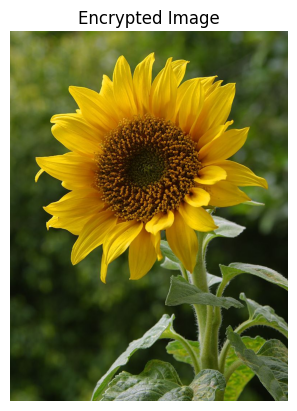
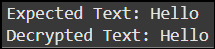

# ASCII-XOR-Image-Steganography
Hiding Information In An Image using LSB encoding and XOR encryption
## Overview
This project implements **text hiding within images** using **Least Significant Bit (LSB) encoding** combined with **XOR encryption** for secure data concealment.
## Features
- Encrypts and hides text inside an image while preserving its visual integrity
- Uses **XOR encryption** for secure message encoding
- Accurately retrieves the hidden text through **bit extraction and decryption**
## Installation
Ensure Python and required libraries are installed. Run:
```bash
pip install opencv-python numpy matplotlib
```
## How it Works
### Encryption
1. Converts text to ASCII values
2. Applies **XOR encryption** using a secret key
3. Embeds encrypted data within image pixels using **LSB encoding**
### Decryption
1. Extracts modified LSB bits from the image
2. Reconstructs the ASCII characters
3. Applies **XOR decryption** to reveal the original text.
## Usage
Run the Python script:
```bash
python src.py
```
### Expected Output
_Expected Text: Hello_

_Decrypted Text: Hello_
## Screenshots
Original Image | Encrypted Image | Decrypted Image
--- | --- | ---
 |  | 
## Limitations
- Limited to **short text messages**, as larger inputs require larger image resolution
- Vulnerable to **image compression**, which may distort the encoded data
- Requires **careful key management** to ensure accurate decryption
## Future Enhancements
- Support for longer text encryption in high-resolution images
- Integration with AI-based steganography for enhance security
- Advanced cryptographic techniques (AES, RSA) for stronger encryption
